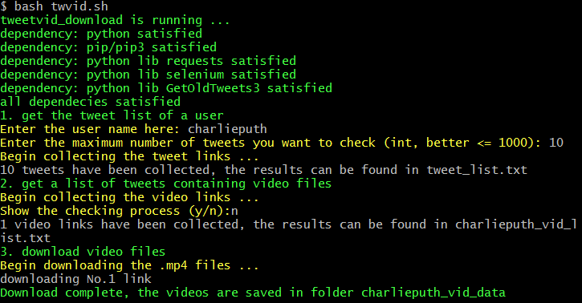

This is a tool to download videos of a specific twitter user without a twitter developer account.<br>
Dependecies needed:<br>
* Python3.x (<font color=Blue>required</font>)
* pip3 (<font color=Blue>required</font>)
* chrome (<font color=Blue>required</font>)
* requests
* GetOldTweets3
* selenium
<br>
<br>
<font size=4 color=orange>Need to make sure that you have chromedriver downloaded and put it in the same directory as python.exe (if you use unix system, put it in the directory /usr/loacl/bin). Check [here](https://chromedriver.chromium.org/downloads) to download the corresponding version</font>
<br>

All you need to do is open the terminal and run this shell script
```shell
bash twvid.sh

```

Running screenshot of the shell script<br>
<br>



